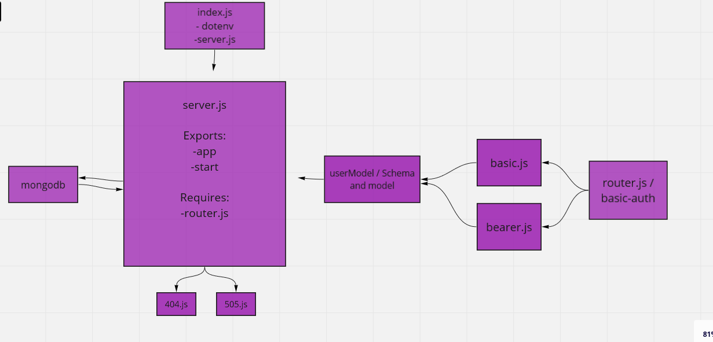

# bearer-auth

## My notes

I create a server for the backend and some test

> Task 1: Fix The Bugs
> Task 2: Secure the JWT Tokens

## Pull_request for the repo

## Github actions

## Heroku applications

## UML diagram

